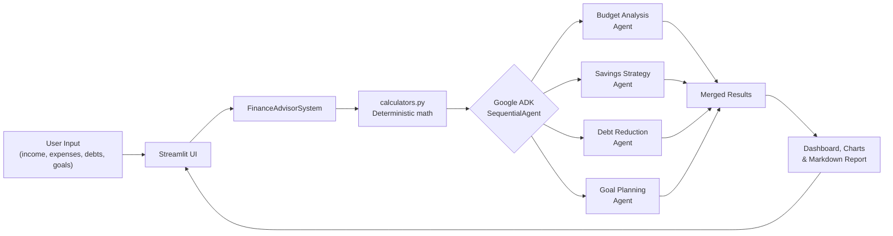

<div align="center">

# 💰 AI Financial Coach

**Turn your income, expenses, debts, and goals into a complete, practical financial plan.**

A multi-agent AI advisor that analyzes your finances and produces a budget breakdown, a savings strategy, a real debt payoff comparison, and a multi-goal funding plan — using Google's Agent Development Kit and Gemini.

[](https://python.org)
[](https://streamlit.io)
[](https://google.github.io/adk-docs/)
[](https://ai.google.dev/)
[](LICENSE)

</div>

---

> Forked and substantially rewritten from [Shubham Saboo's `ai_financial_coach_agent`](https://github.com/Shubhamsaboo/awesome-llm-apps/tree/main/advanced_ai_agents/multi_agent_apps/ai_financial_coach_agent). See [NOTICE](NOTICE) for the full list of changes.
>
> **Why this fork exists:** the original asked an LLM to *compute* debt amortization and emergency-fund numbers from scratch — LLMs are not reliable calculators, and two runs on the same input could produce different answers. This version draws a hard line: **agents reason, code computes.** Every number that requires arithmetic is computed by tested, deterministic Python; the four Gemini agents only categorize, prioritize, and write recommendations on top of numbers they're handed.

---

## Features

| Feature | Description |
|---|---|
| **Multi-Agent Analysis** | Four specialized agents — budget, savings, debt, and goals — orchestrated as a Google ADK `SequentialAgent` |
| **Deterministic Finance Math** | Real amortization, emergency-fund sizing, and goal projections computed in Python and unit tested, never guessed by the LLM |
| **Debt Payoff Comparison** | True month-by-month avalanche vs. snowball simulation, with total interest and time-to-debt-free compared side by side |
| **Goal Planning** | Multi-goal budgeting that funds goals in priority order from whatever monthly surplus is left over, with realistic timelines when goals don't fully fit |
| **CSV or Manual Expenses** | Upload transactions or enter monthly totals by category, with a multi-month spending trend chart when your data spans more than one month |
| **Downloadable Report** | The full financial plan exported as a shareable Markdown file |
| **SaaS-Style Dashboard** | A custom theme, gradient hero header, and stat-card summary in place of default Streamlit widgets |

---

## Architecture



Numbers flow **into** the agents from `calculators.py`, never the other way around — the agents never originate a dollar figure.

---

## Tech Stack

- **Framework**: [Streamlit](https://streamlit.io/)
- **AI Orchestration**: [Google Agent Development Kit (ADK)](https://google.github.io/adk-docs/)
- **LLM Provider**: [Google Gemini](https://ai.google.dev/) (`gemini-2.5-flash`)
- **Data**: [Pandas](https://pandas.pydata.org/)
- **Charts**: [Plotly](https://plotly.com/python/)
- **Validation**: [Pydantic](https://docs.pydantic.dev/)
- **Testing**: [Pytest](https://pytest.org/)

---

## Quick Start

### Prerequisites

- Python ≥ 3.10
- A free Gemini API key from [Google AI Studio](https://aistudio.google.com/apikey)

### Installation

```bash
# Clone the repository
git clone https://github.com/YOUR_USERNAME/ai-financial-coach.git
cd ai-financial-coach

# Create a virtual environment
python -m venv venv
source venv/bin/activate    # macOS/Linux
# venv\Scripts\activate     # Windows

# Install dependencies
pip install -r requirements.txt
```

### Configuration

```bash
cp .env.example .env
# then edit .env and set GOOGLE_API_KEY
```

### Run

```bash
streamlit run app.py
```

The app opens at **http://localhost:8501/**.

---

## Project Structure

```text
ai-financial-coach/
├── app.py                     # Streamlit entrypoint
├── financial_coach/
│   ├── models.py              # Pydantic schemas (LLM "insight" outputs vs. computed data)
│   ├── calculators.py         # Deterministic finance math — unit tested
│   ├── csv_utils.py           # CSV parsing, validation, monthly trend aggregation
│   ├── charts.py              # Plotly chart builders (colorblind-safe fixed palette)
│   ├── theme.py               # Custom CSS theme, hero header, stat cards
│   ├── agents.py              # The four ADK LlmAgent definitions + coordinator
│   ├── advisor.py             # Orchestration: precompute -> run agents -> merge results
│   ├── report.py              # Markdown report generation
│   └── ui.py                  # Streamlit display + input-collection functions
├── tests/
│   └── test_calculators.py    # Unit tests for all deterministic math
├── Dockerfile
└── requirements.txt
```

---

## Usage

1. Open `http://localhost:8501/` in your browser.
2. Enter your monthly income, dependants, and current emergency savings.
3. Add your expenses — upload a CSV of transactions or enter monthly totals by category.
4. Add any debts and financial goals you want a plan for.
5. Click **Analyze My Finances**. The four agents run in sequence, each reading the deterministic numbers and the previous agent's output.
6. Review your budget, savings strategy, debt payoff comparison, and goal plan, then download the full report as Markdown.

---

## Environment Variables

| Variable | Required | Description |
|---|---|---|
| `GOOGLE_API_KEY` | Yes | Gemini API key used by all four agents |

---

## Docker Deployment

```bash
# Build the image
docker build -t ai-financial-coach .

# Run the container (ensure your .env is passed)
docker run -p 8501:8501 --env-file .env ai-financial-coach
```

---

## Testing

```bash
pip install -r requirements-dev.txt
pytest
```

All debt-amortization, emergency-fund, and goal-projection math is covered by unit tests in `tests/test_calculators.py`.

---

## CSV File Format

```csv
Date,Category,Amount
2024-01-01,Housing,1200.00
2024-01-02,Food,150.50
2024-01-03,Transportation,45.00
```

Required columns: `Date` (YYYY-MM-DD), `Category`, `Amount` (currency symbols and commas are stripped automatically). A template is available from the app's sidebar. Upload multiple months of data to see the spending trend chart.

---

## Privacy

All data is processed locally in your session; nothing is persisted to disk. Financial data is sent to Google's Gemini API only as part of generating the analysis.

## License

Apache License 2.0 — see [LICENSE](LICENSE) and [NOTICE](NOTICE).

This is an educational project, not professional financial advice.

---

<div align="center">
<sub>Built using Python, Streamlit, Google ADK & Gemini</sub>
</div>
